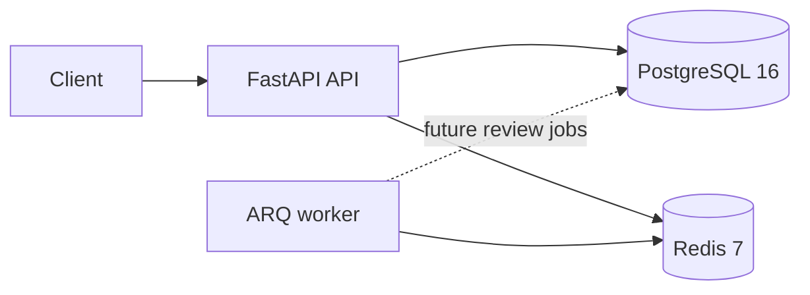

# DevAssist

An auditable GitHub pull request review assistant. **Phase 1 is implemented:**
FastAPI foundation, PostgreSQL schema and migration, JSON request logs, readiness
checks, and a four-service Docker Compose stack. Webhooks and reviews are upcoming
phases; the worker currently starts idle.



## Start locally

Install Docker with Compose, then from this directory:

```sh
cp .env.example .env
docker compose up --build
```

PowerShell: use `Copy-Item .env.example .env` for the first command.
Compose waits for PostgreSQL and Redis, applies `alembic upgrade head` before
starting the API, and starts the worker after API readiness succeeds. The initial
startup requires internet access to download images and packages.

- API documentation: http://localhost:8000/docs
- Liveness: http://localhost:8000/healthz
- Readiness: http://localhost:8000/readyz (503 when either dependency is unavailable)

The development database credentials in Compose are local placeholders. Dependency
ports bind to loopback. Use your own credentials and deployment configuration in
production. Stop with `docker compose down`; named volumes retain data.

## Python development

Use Python 3.12:

```sh
python -m venv .venv
# PowerShell: .venv\Scripts\Activate.ps1
# Linux/macOS: source .venv/bin/activate
python -m pip install -e '.[dev]'
docker compose up -d postgres redis
alembic upgrade head
uvicorn app.main:create_app --factory --reload --no-access-log
```

Run the worker separately with `arq app.worker.settings.WorkerSettings`.
Repository and webhook credential references store environment variable names,
not secret values. `installation_id` supports future GitHub App authentication.
UUIDs are generated by the ORM; timestamps are timezone-aware. `updated_at` is
automatically refreshed by SQLAlchemy updates. Audit JSON will hold call summaries,
never full diffs or credentials.

## Configuration

All current application settings are shown in `.env.example`. Environment values
override that file. Compose overrides database and Redis URLs with service DNS names.

| Variable | Default | Purpose |
| --- | --- | --- |
| `ENVIRONMENT` | `development` | development, test, or production |
| `LOG_LEVEL` | `INFO` | Application log level |
| `POSTGRES_PASSWORD` | `devassist` in example | Compose-only local database password |
| `DATABASE_URL` | Local PostgreSQL asyncpg URL | Database connection secret |
| `REDIS_URL` | `redis://localhost:6379/0` | Redis connection secret |
| `HEALTH_CHECK_TIMEOUT_SECONDS` | `2` | Per-dependency readiness timeout |
| `DB_POOL_SIZE` | `5` | Persistent database connections |
| `DB_MAX_OVERFLOW` | `10` | Additional pooled connections |

Logs use JSON and include a validated or generated `X-Request-ID`, also returned
in response headers. Access logs omit URLs, query parameters, headers, and bodies.
Exception formatting includes the exception type without its potentially sensitive message.

## Checks

```sh
ruff check .
ruff format --check .
mypy
pytest
```

Unit tests require no running services. They cover healthy, failed and timed-out
readiness probes, liveness independent of dependencies, request IDs, log formatting,
schema constraints, and offline PostgreSQL migration generation. Pytest enforces
80% coverage for implemented API and service modules.

With PostgreSQL and Redis running, run the integration test against a **test database**:

```sh
# Set DATABASE_URL and REDIS_URL for your test services first.
RUN_INTEGRATION_TESTS=1 pytest
```

PowerShell: `$env:RUN_INTEGRATION_TESTS = '1'; pytest`.
The integration test applies migrations, checks ORM/migration parity, and exercises
readiness against real services. This opt-in avoids modifying a database implicitly.

## Phase boundaries

The initial schema uses exactly the four specified review statuses. The phase 7
superseded-run representation needs clarification before that phase, since
`superseded` is not among those four statuses. GitHub setup, review processing,
LLM configuration, and CI/CD will be added in their specified phases.
